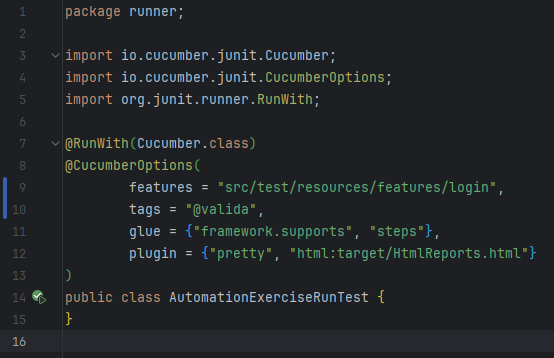
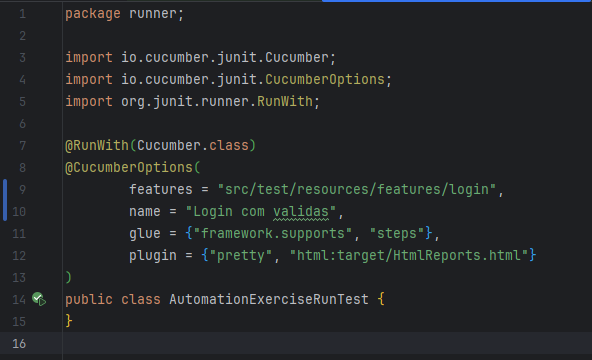

# 🧪 Automation Exercise

## 📌 Descrição do projeto
O objetivo deste projeto é criar uma automação completa de testes para o site [Automation Exercise](https://automationexercise.com). O foco é identificar cenários de teste, implementá-los e configurar relatórios detalhados de execução, aplicando boas práticas de automação.

---

## 📑 Índice

1. [Sobre o Projeto](#sobre-o-projeto)  
2. [Funcionalidades](#funcionalidades)  
3. [Tecnologias Utilizadas](#tecnologias-utilizadas)  
4. [Como Executar](#como-executar)  
5. [Autor](#autor)

---

## 🔍 Sobre o projeto

A automação cobre funcionalidades críticas do site, garantindo a confiabilidade da aplicação e proporcionando facilidade na detecção de falhas. Entre os cenários contemplados estão:

- Login de usuários  
- Navegação no catálogo de produtos  
- Adição de itens ao carrinho  
- Finalização de compras  
- Geração de relatórios de execução

---

## ✅ Funcionalidades do projeto

- Acesso ao site Automation Exercise e autenticação de usuários  
- Inclusão de produtos no carrinho e verificação de detalhes  
- Simulação de pagamento e conclusão da compra  
- Validação do resumo do pedido finalizado  
- Geração de relatórios com detalhes dos testes executados

---

## 💻 Tecnologias usadas

### Liguagem de programação:
* [JAVA (JDK 17)](https://www.oracle.com/java/technologies/downloads/#java17)

### Ferramenta:
* [Intellij IDEA](https://www.jetbrains.com/pt-br/idea/)
* [Maven](https://maven.apache.org/)
* [Cucumber](https://cucumber.io/)

---

## 🚀 Como executar

### Pré-requisitos

Certifique-se de que sua máquina possui os seguintes itens instalados:

- Git  
- Maven  
- JDK 17  

> **Recomendação:** Utilize uma IDE como o IntelliJ IDEA para facilitar o desenvolvimento e execução.

---

### Passo a passo

#### 🔧 Opções para executar os testes:

1. **Clone o repositório:**
```bash
git clone https://github.com/JefersonEugenio/AutomationExerciseCucumber.git
cd AutomationExerciseCucumber
Executar via terminal: "mvn test"
```
2. **Executar via IDE(Intellij)**
* Abra o projeto na IDE.
* Acesse o caminho ``src/test/java/runner/AutomationExerciseRunTest.``
* Clique no ícone de execução (▶️) para rodar os testes.

🏷️ **Execução com Tags ou Cenários Específicos:**
Você pode filtrar os testes usando @tags ou o nome exato do cenário.

**Exemplo:**
<br>



### 📊 Visualize os relatórios:
Após a execução dos testes, acesse o diretório:
```src/main/resources/report```
Lá você encontrará os arquivos HTML com o relatório detalhado da execução.

## 👨‍💻 Autor
| [<br><sub>Jeferson Lopes Eugenio</sub>](https://github.com/JefersonEuenio) |
| :---: |
